# Smart Retail Shelf Monitoring System

An AI-powered Smart Retail Shelf Monitoring System that automates shelf inventory monitoring using YOLO Object Detection, Computer Vision, Flask, and OpenCV. The system continuously monitors retail shelves, detects low-stock, empty shelves and displaced products, and provides a real-time dashboard for inventory management.

---

## Features

- Live camera monitoring
- YOLO-based object detection
- Automatic product counting
- Low stock detection
- Displaced product detection
- Real-time dashboard
- Detection history logging
- Snapshot capture for alerts
- User authentication (Login & Registration)
- SQLite database integration
- Automatic monitoring with configurable scan interval

---

## Technologies Used

### Backend
- Python
- Flask
- SQLite

### Computer Vision
- OpenCV
- Ultralytics YOLO
- NumPy

### Frontend
- HTML
- CSS
- JavaScript
- Bootstrap

### Database
- SQLite

---

## Project Structure

```
smart-retail-shelf/
│
├── app.py
├── detection_engine.py
├── database_manager.py
├── retail.db
├── requirements.txt
├── runtime.txt
│
├── models/
│   └── best.pt
│
├── static/
│   ├── css/
│   ├── js/
│   ├── detections/
│   └── images/
│
├── templates/
│   ├── dashboard.html
│   ├── login.html
│   ├── register.html
│   └── shelf_details.html
│
└── README.md
```

---

## Installation

### Clone the repository

```bash
git clone https://github.com/FiDaa-faTHima/smart-retail-shelf.git

cd smart-retail-shelf
```

### Create a virtual environment

Windows

```bash
python -m venv venv

venv\Scripts\activate
```

Linux/macOS

```bash
python3 -m venv venv

source venv/bin/activate
```

### Install dependencies

```bash
pip install -r requirements.txt
```

---

## Running the Application

```bash
python app.py
```

Open your browser:

```
http://127.0.0.1:5000
```

---

## How It Works

1. User logs into the system.
2. Camera is activated after permission is granted.
3. YOLO detects products on each shelf.
4. Products are counted automatically.
5. The system compares detected products with expected shelf capacity.
6. Low-stock and displaced products generate alerts.
7. Detection results are stored in the SQLite database.
8. The dashboard updates automatically.

---

## System Modules

- User Authentication
- Live Camera Monitoring
- Product Detection
- Shelf Monitoring
- Alert Management
- Inventory Dashboard
- Detection Logs
- Shelf Details
- Database Management

---

## Dataset

The object detection model was trained using a custom retail shelf dataset.

Model location:

```
models/best.pt
```

---

## Screenshots


### Login Page


### Registration Page
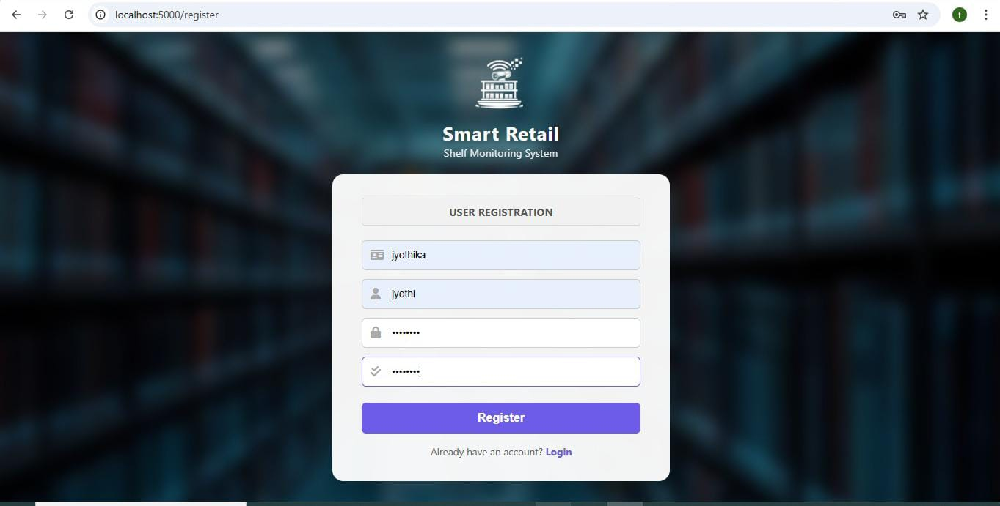

### Dashboard
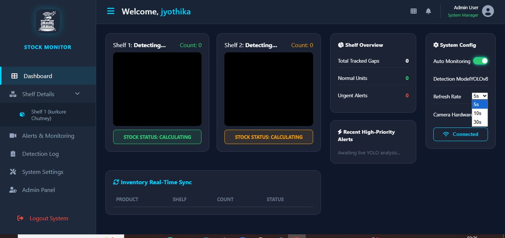

### Active Dashboard
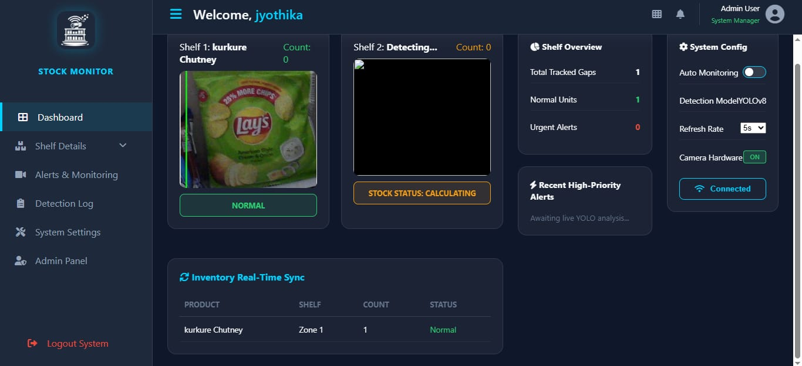

### Admin Panel
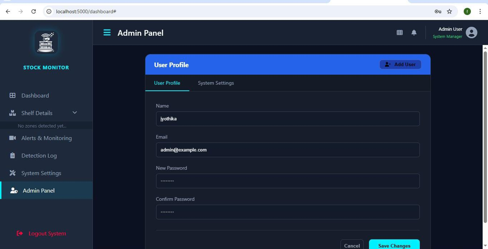

### Camera Access
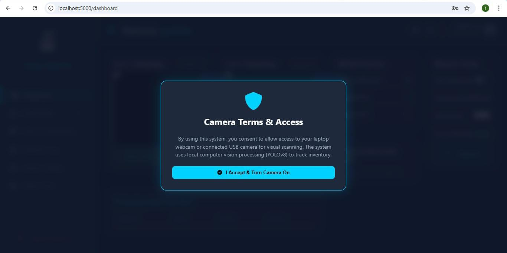

### Camera Initialization
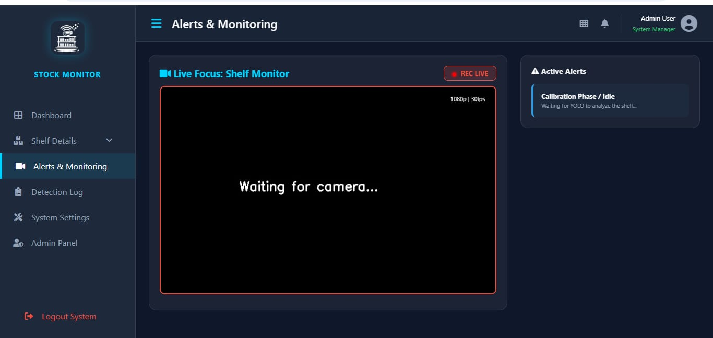

### Camera ON
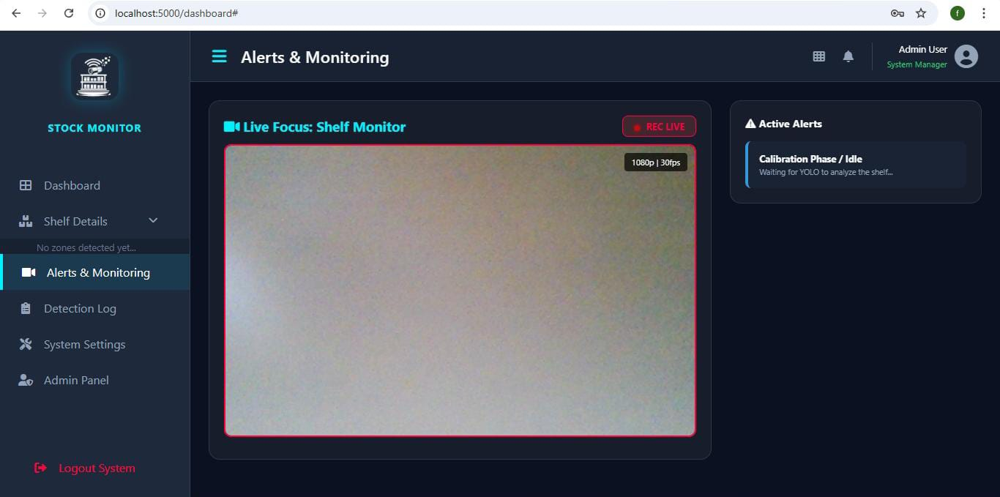

### Alerts Monitoring


### Normal Shelf Alert
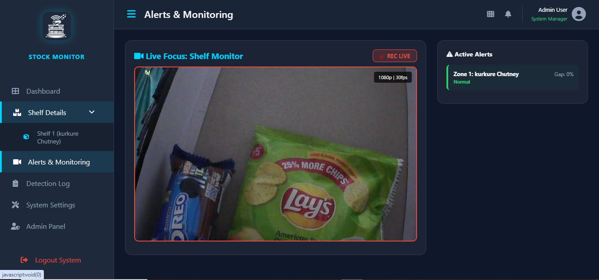

### Stockout Alert
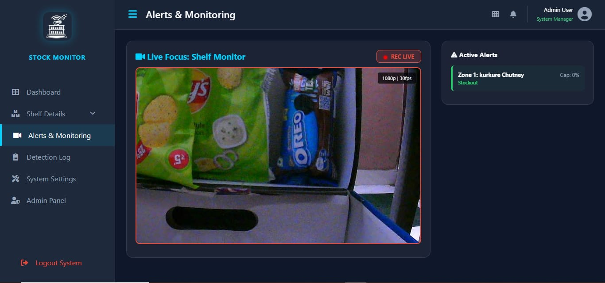

### Detection History
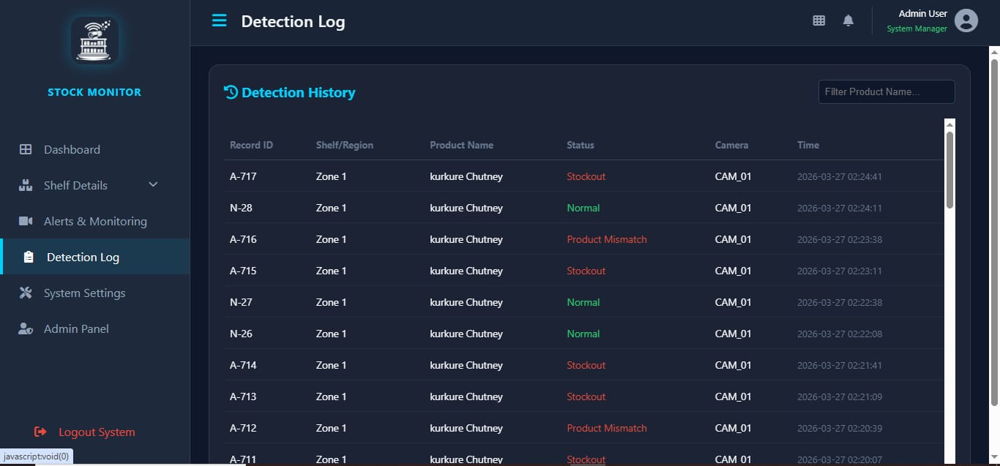

### Empty Detection Log
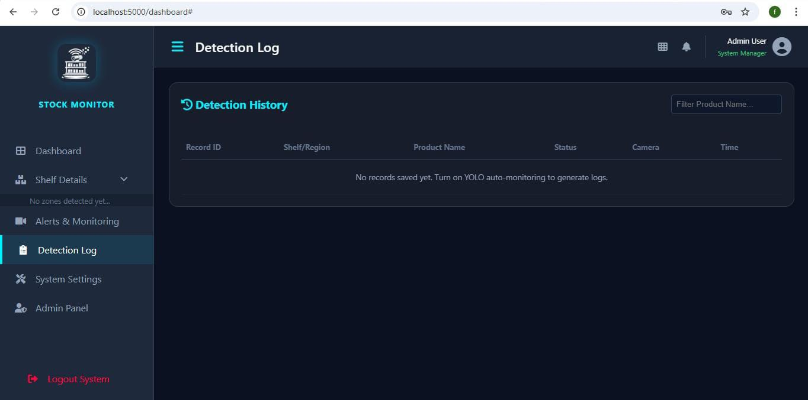

### System Settings
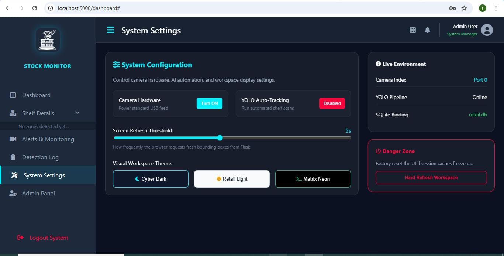

---

## Configuration

The detection interval can be changed from the dashboard.

Default:

```
5 seconds
```

YOLO model location:

```
models/best.pt
```

Database:

```
retail.db
```

---

## Future Improvements

- Multi-camera support
- Email notifications
- SMS alerts
- Cloud database integration
- Product expiry detection
- Barcode scanning
- Mobile application
- Real-time analytics
- REST API
- Docker deployment

---

## Author

 Fida Fathima

GitHub: https://github.com/FiDaa-faTHima
--